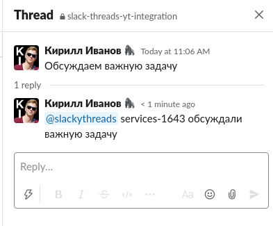
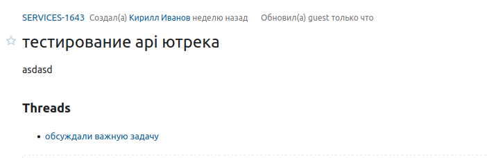

# Slackyt

[English version](docs/README_ENG.md)

1. [О приложении](#about)
2. [Настройка бота](#setup)
3. [Запуск на локальной машине](#local-run)
4. [Деплой на удаленный сервер](#deploy)


## Для чего это нужно <a id="about"></a>
Приложение позволяет связать обсуждения в слаке с карточкой задачи в ютреке через slack бота.

### Пример привязки обсуждения к задаче:



Превращается в



### Синтаксис вызова следующий:
`{меншн бота} {айди задачи} {опционально: описание обсуждения}`
## Настройка бота <a id="setup"></a>

1. Создайте бота в своем рабочем окружении по [ссылке](https://my.slack.com/services/new/bot) и получите api token слака
2. Получите api токен ютрека, руководство по [ссылке](https://www.jetbrains.com/help/youtrack/standalone/Manage-Permanent-Token.html)
3. Создайте в директории config/ файл secret.exs, внесите в него информацию по примеру в config/secret.example.exs


## Запуск приложения на локальной машине <a id="local-run"></a>

### Из исходников
Требования:
- Elixir 1.12.3 (compiled with Erlang/OTP 24)

Шаги:

1. Установите зависимости через `mix deps.get`
2. Скомпилируйте зависимости через `mix deps.compile`
3. Запустите сервер приложения черех `mix run --no-halt`

### Через докер-контейнер
Требования:
- docker
- docker-compose
  
Шаги:

В текущей директории введите `docker-compose up`

## Деплой на удаленный сервер <a id="deploy"></a>

Требования: 
- Python 3.7

Шаги:
1. Перейдите в директорию ansible
1. Установите python poetry `python3 -m pip install poetry`
1. Активируйте виртуальное окружение `python3 -m poetry shell`
1. Откройте файл hosts.ini и укажите сервер, на который будет выгружаться приложение в формате `пользователь@адрес сервера`
1. Откройте файл variables.yml и укажите переменные:
   ```
   user: директория пользователя на сервере, bot_dir: директория, куда будет устанавливаться приложение
  
1. Запустите выгрузку командой `ansible-playbook -i hosts.ini --extra-vars "@variables.yml"  deploy.yml`

Компиляция на слабых машинах занимает определенное время, наберитесь терпения. На сервере при компиляции требуется как минимум 2 гигабайта оперативной памяти, при необходимости создайте swap файл
